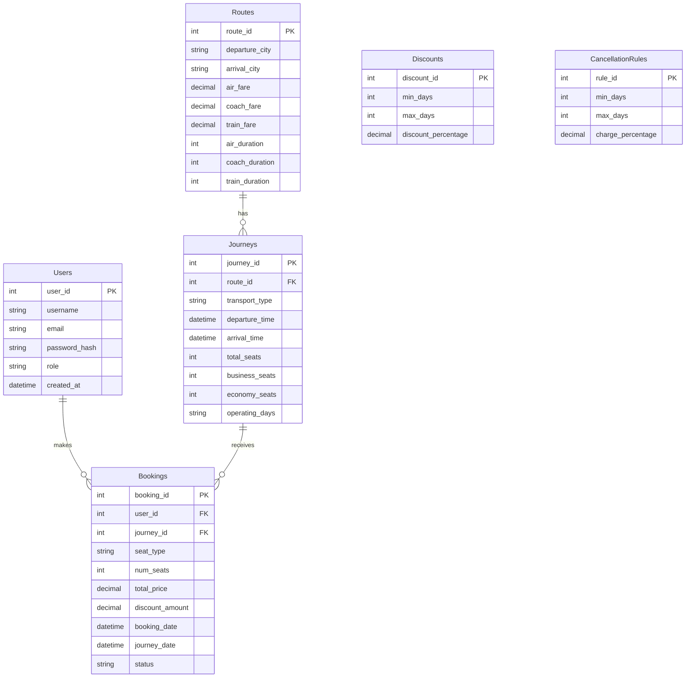

# HT Booking System Database Design

## 1. Entity Relationship Diagram (ERD)



## 2. Normalization Process

### Unnormalized Form (UNF)
Initial data structure containing all information in a single table:

```
Booking_Data {
    user_id, username, email, password, role,
    journey_id, departure_city, arrival_city,
    transport_type, departure_time, arrival_time,
    seat_type, num_seats, fare, total_price,
    booking_date, journey_date, status
}
```

### First Normal Form (1NF)
Split into separate tables to eliminate repeating groups:

1. Users (user_id, username, email, password, role)
2. Routes (route_id, departure_city, arrival_city, air_fare, coach_fare, train_fare)
3. Journeys (journey_id, route_id, transport_type, departure_time, arrival_time, total_seats)
4. Bookings (booking_id, user_id, journey_id, seat_type, num_seats, total_price, booking_date, journey_date, status)

### Second Normal Form (2NF)
Remove partial dependencies:

1. Users (user_id, username, email, password, role)
2. Routes (route_id, departure_city, arrival_city, air_fare, coach_fare, train_fare)
3. Journeys (journey_id, route_id, transport_type, departure_time, arrival_time, total_seats)
4. Bookings (booking_id, user_id, journey_id, seat_type, num_seats, total_price, booking_date, journey_date, status)
5. Discounts (discount_id, min_days, max_days, discount_percentage)
6. CancellationRules (rule_id, min_days, max_days, charge_percentage)

### Third Normal Form (3NF)
Remove transitive dependencies:

The database is already in 3NF as all non-key attributes are fully dependent on the primary key and there are no transitive dependencies.

## 3. Key Design Decisions

### Security Measures
1. Password hashing using bcrypt
2. Role-based access control (Admin/Standard users)
3. SQL injection prevention through parameterized queries
4. Input validation and sanitization

### Business Rules Implementation
1. Seat allocation:
   - Air: 130 seats (26 business, 104 economy)
   - Coach: 45 seats (9 business, 36 economy)
   - Train: 250 seats (50 business, 200 economy)

2. Fare calculation:
   - Coach fare = Air fare / 4
   - Train fare = Air fare * 2.5
   - Business class = Standard fare * 2

3. Operating days:
   - Air: Monday to Friday
   - Coach: Saturday to Thursday
   - Train: All days

4. Discount rules:
   - 80-90 days: 25%
   - 60-79 days: 15%
   - 45-59 days: 10%
   - <45 days: No discount

5. Cancellation rules:
   - >60 days: No charge
   - 30-60 days: 40% charge
   - <30 days: 100% charge

### Additional Features
1. Booking history tracking
2. User preferences storage
3. Journey availability checking
4. Seat allocation management
5. Price calculation with discounts
6. Cancellation handling
7. Reporting capabilities for admin users

## 4. Sample Data Examples

### Route Example
```sql
INSERT INTO Routes (departure_city, arrival_city, air_fare) 
VALUES ('Bristol', 'Manchester', 80.00);
```

### Journey Example
```sql
INSERT INTO Journeys (route_id, transport_type, departure_time, arrival_time, total_seats) 
VALUES (1, 'AIR', '2024-03-20 09:00:00', '2024-03-20 10:15:00', 130);
```

### Booking Example
```sql
INSERT INTO Bookings (user_id, journey_id, seat_type, num_seats, total_price, booking_date, journey_date) 
VALUES (1, 1, 'ECONOMY', 2, 160.00, '2024-01-01', '2024-03-20');
```

## 5. Integration with Flask

The database design supports the following Flask integration points:

1. User Authentication:
   - Login/Registration
   - Password reset
   - Session management

2. Journey Management:
   - Route search
   - Availability checking
   - Seat selection
   - Price calculation

3. Booking System:
   - Booking creation
   - Payment processing
   - Receipt generation
   - Cancellation handling

4. Admin Features:
   - User management
   - Journey management
   - Booking reports
   - System configuration 